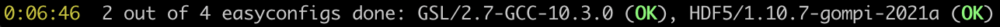

.. _progress_bars:

Progress bars
=============

*(supported since: EasyBuild v4.5.0)*

.. contents::
    :depth: 3
    :backlinks: none

.. _progress_bar_generic:

General information on progress bars
------------------------------------

EasyBuild will show **progress bars** for various aspects of the installation progress
by default, if the `Rich <https://pypi.org/project/rich/>`_ Python package is available.

The progress bars shown by EasyBuild are *dynamic*: they are only visible when they are relevant.

Note that for most progress bars the amount of progress made is assumed to be linear across the whole process,
even though it is typically not. Some installation steps take significantly longer than others,
and some easyconfigs may install in a couple minutes while others take much longer, but it is very difficult
to get a good estimate on how much time will be needed.
The download progress bar is an exception here (as long as the size of the file to download could be determined first).

.. _progress_bars_types:

Types of progress bars
----------------------

EasyBuild will show different progress bars to show the progress for different aspects of the installation process.

Overall progress bar (status bar)
~~~~~~~~~~~~~~~~~~~~~~~~~~~~~~~~~

The progress bar at the bottom, also known as the *status bar*, shows the *overall progress*
in installing software for the currently active EasyBuild session.

From left to right, the following information is included:

* The total amount of time that this EasyBuild session has spent on installing software.
* The number of easyconfigs that have been processed already, the total number of easyconfigs
  being processed, and a count of easyconfigs that failed to installed so far (if there are any).
* The list of already processed easyconfigs, along with the result:
    * ``OK`` (in green) for a successful installation;
    * ``FAILED`` (in red) for a failed installation;

Processed easyconfigs are shown in reversed order: most recently processed easyconfigs are listed first.

If EasyBuild is configured to continue processing easyconfigs when an installation failed
(for example when using ``--upload-test-report``), failing easyconfigs are listed before easyconfigs
that were installed successfully, to highlight failing installations.

The status bar is not shown if only a single easyconfig file is being installed,
and is hidden automatically as soon as the EasyBuild session finishes.

Easyconfig progress bar
~~~~~~~~~~~~~~~~~~~~~~~

A dedicated progress bar is shown for every easyconfig file that is installed,
right above the status bar (if present), which shows:

* The name of the module that is being installed.
* The currently active installation step.
* The number of completed installations steps, as well as the total number of installation steps for this easyconfig.
* A visual progress bar that represents the progress in installing this easyconfig.
* The total amount of time spent on installing this easyconfig so far.

The progress bar for a specific easyconfig file will be hidden as soon as the installation
finishes (regardless of whether it was successful or not).

Download progress bars
~~~~~~~~~~~~~~~~~~~~~~

.. image:: img/progress_bar_download.png
  :height: 56px
  :align: center

When EasyBuild is downloading one or more files,
a dedicated progress bar will be visible:

* For large downloads: the name of the file being downloaded,
  a visual progress bar, the amount of data downloaded so far,
  the amount of data to download in total, the average download speed,
  and the estimated time remaining to complete the download (based on average download speed).
* If there are multiple files being downloaded: an overview of how
  many files have been downloaded already, and how many need to be downloaded in total.

The download progress bars will be hidden as soon as the downloading has been completed (or has failed).

Extensions progress bar
~~~~~~~~~~~~~~~~~~~~~~~

When extensions are being installed for a particular easyconfig,
a dedicated progress bar will pop up for the ``extensions`` step,
which shows:

* The name of the extension that is currently being installed.
* The number of extensions installed so far, and the total number of extensions to install.
* A visual progress bar that represents the progress for installing extensions so far.
* The total amount of time spent installing extensions for this easyconfig.

.. _progress_bars_configuration:

Relevant configuration options
------------------------------

``output-style``
~~~~~~~~~~~~~~~~

The ``output-style`` configuration option determines the output style of the ``eb`` command.

Setting ``output-style`` to '``rich``' results in rich output being produced, which includes progress bars.
This also makes ``Rich`` a *required* dependency for EasyBuild.

Using '``basic``' as value for ``output-style`` results in basic output (no progress bars).

By default ``output-style`` is set to '``auto``', which implies using the ``Rich`` Python package to produce
rich output (incl. progress bars) if is available,
and falling back to using the basic output style if ``Rich`` is not available.

``show-progress-bar``
~~~~~~~~~~~~~~~~~~~~~

The ``show-progress-bar`` configuration option (enabled by default) controls whether or not
progress bars are shown, regardless of the active output style and whether ``Rich`` is available.
